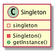

# Singletonパターン
- singleton とは一枚札のこと。一枚札とはトランプの一組に唯一のカード。Singleton パターンとは、このような唯一の存在を保証するためのパターン。
- あるクラスのインスタンスが一つしかないことを保証したい場合につかう

## 実際に使ってみる
### 題材
- 図書館の貸出帳を考える
- 図書の貸出に当たって、その貸出帳がいくつあるのかわからないような状態では、管理がとても難しくなる

```python
# -*- coding:utf-8 -*-


class RegisterNote:
    __singleton = None
    __register = None

    def __new__(cls, *args, **kwargs):
        if cls.__singleton == None:
            cls.__singleton = super(RegisterNote, cls).__new__(cls)
        return cls.__singleton

    def set_register(self, register=None):
        self.__register = register

    def get_register(self):
        return self.__register

RegisterNote()  # クラス定義の直下に書いて、インスタンスを作るために必ず呼ぶ
```
- 下記の通り、２つのインスタンス（ `rn1` `rn2` ）は同じインスタンスだということがわかる
```python
>>> class RegisterNote:
...     __singleton = None
...     __register = None
...
...     def __new__(cls, *args, **kwargs):
...         if cls.__singleton == None:
...             cls.__singleton = super(RegisterNote, cls).__new__(cls)
...         return cls.__singleton
...
...     def set_register(self, register=None):
...         self.__register = register
...
...     def get_register(self):
...         return self.__register
...     
>>> RegisterNote()
<RegisterNote object at 0x10c48f9e8>
>>> rn1 = RegisterNote()
...
>>> rn2 =RegisterNote()
...
>>> rn1
<RegisterNote object at 0x10c48f9e8>
>>> rn2
<RegisterNote object at 0x10c48f9e8>
>>> rn2.set_register('book book book')
>>> rn1.get_register()
'book book book'
```

## 備考
- Javaの場合はprivateを使えば容易にsingletonを実装できる
```java
public class RegisterNote{
    private static RegisterNote registerNote = new RegisterNote();
    private RegisterNote(){}
    public static RegisterNote getInstance(){
        return registerNote;
    }
}
```
- registerNote は、RegisterNote クラスが初期化されるときに生成される。
- クラスが初期化されるタイミングは Java の言語仕様で定義されており、 初めてインスタンス化された時や、初めて static メソッドが呼び出されたタイミングなどに行われる。
  - すなわち、このサンプルプログラムでは、staticメソッドであるgetInstance メソッドが初めて呼ばれるときにRegisterNode クラスが初期化され、そのときに一度だけRegisterNode クラスのインスタンスが生成されることになる。
- この後、getInstance メソッドが呼ばれたときには、既に生成されている registerNote オブジェクトが返されることになる。
- pythonにはprivateが存在しないので、上記のように `__new__()` メソッドを使う。
  - ` __init__()` メソッドより前に呼ばれ、インスタンスを生成して返す

## Singletonパターンのまとめ

