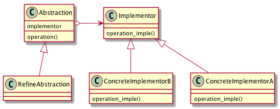

# Bridgeパターン
- 機能と実装を分離して、それぞれを独立に拡張することができるようになる
- 例
  - ある methodA というメソッドを持つクラス MyClassA は、methodA メソッドの実装が異なる MyClassASub1、MyClassASub2 という２つのクラスによって継承されているとする
  - MyClassA にmethodB というメソッドを追加するために、MyClassB クラスという MyClassA を継承するクラスを作成したとする
  - MyClassB でも、MyClassASub1、MyClassASub2 で実装している methodA と同じ実装を利用したい場合、MyClassB クラスを継承する MyClassBSub1、MyClassBSub2 といったクラスを作成する必要がある　←　**めんどい**
- 規模が大きくなると面倒さが倍々ゲームになる

## 実際に使ってみる
### 題材
- ソート機能を持つ抽象クラスSorter と、この Sorter クラスで定義されている抽象メソッドである sort(Object obj[]) メソッドを実装するクラス (QuickSorter クラス、BubbleSorter クラス) について考える
- Sorter クラス、QuickSorter クラス、BubbleSorter クラスのコードはそれぞれ以下のようになっている。ソート部分の実装に関しては、ここでは重要でないため省略する。

```python
# -*- coding:utf-8 -*-
from abc import ABCMeta, abstractmethod


class Sorter(metaclass=ABCMeta)

    @abstractmethod
    def sort(self, obj):
        pass


class QuickSorter(Sorter):

    def sort(self, obj):
        # クイックソート
        pass


class BubbleSorter(Sorter):

    def sort(self, obj):
        # バブルソート
        pass
```

- Sorterクラスにソートにかかった時間を表示する機能を持つ timer_sorter メソッドを追加したい

```python
from datetime import datetime

class TimerSorter(metaclass=ABCMeta, Sorter):

    @abstractmethod
    def time_sorter(self, obj):
        start = datetime.now()
        Sorter.sort(obj)
        end = datetime.now()
        print("time:" + str((end - start)))
```

- このままだと、TimerSorterクラスに実装を与えられない
  - 実装するためにはQuickSorter/BubbleSorter相当のクラスを用意する必要がある
- Bridgeパターンで考える。実装の変更が考えられるメソッドに関しては、実装用のクラス階層に委譲するように設計する。
- 実装用のクラス階層：ここでは sort メソッドの実装を与えるクラス階層として、SortImple クラスを親とするクラス階層を考える

```python
class SortImple(metaclass=ABCMeta):
    @abstractmethod
    def sort(self, obj):
        pass


class Sorter:
    si = SortImple()

    @staticmethod
    def sorter(si):
        Sorter.si = si

    def sort(self, obj):
        Sorter.si.sort(obj)


class QuickSorterImple(SortImple):

    def sort(self, obj):
        # クイックソート
        pass


class BubbleSorterImple(SortImple):

    def sort(self, obj):
        # バブルソート
        pass

```

- こうすることで機能を追加するために、Sorter クラスを拡張して作成した新しいクラスでも、すでに存在する実装部分を利用することができるようになる。例えば、Sorter クラスを拡張する TimerSorter クラスを作成する場合には、以下のようになる。

```python
from datetime import datetime


class TimerSorter(metaclass=ABCMeta, Sorter):

    def __init__(self, sort_impl):
        super(sort_impl)

    @abstractmethod
    def time_sorter(self, obj):
        start = datetime.now()
        Sorter.sort(obj)
        end = datetime.now()
        print("time:" + str((end - start)))
```

- 機能を拡張するためのクラス階層と、実装を拡張するためのクラス階層を分けておくことで、実装階層クラスと機能拡張クラスを好みの組み合わせで利用することができるようになる
- 今回の例では、Sorter クラスと SortImple クラスが機能拡張クラス階層と実装拡張クラス階層を橋渡しする役目を果たしている


## Builderパターンのまとめ

