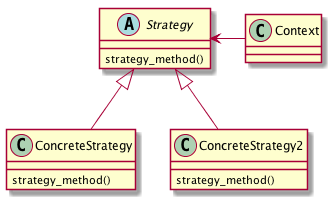

# Strategyパターン
- 普通にプログラミングしていると、メソッドの中に溶け込んだ形でアルゴリズムを実装してしまうことがある
  - if 文などで分岐させることでアルゴリズムを変更するなど
- Strategy パターンでは、戦略の部分を意識して別クラスとして作成するようにする
- 戦略x部分を別クラスとして作成しておき、戦略を変更したい場合には、利用する戦略クラスを変更するという方法で対応する
- Strategy パターンを利用することで、メソッドの中に溶け込んだ形のアルゴリズムより柔軟でメンテナンスしやすい設計となる

## 実際に使ってみる
### 題材
- 状況に応じてアルゴリズムを変えなければならないことは多々ある。例えばゲームのプログラムでは、難易度の設定によって、その戦略アルゴリズムを変えるなど。
- ここでは簡単に、大小の比較を行うアルゴリズムを考えてみる。
- まずは、人間を表す Human クラスを作成する。Human クラスは、名前、身長、体重、年齢の4つのパラメータを持つものとする。

```python
# -*- coding:utf-8 -*-
from abc import ABCMeta, abstractmethod


class Human:

    def __init__(self, name, height, weight, age):
        self.name = name
        self.height = height
        self.weight = weight
        self.age = age
```

- ここで、2つのHuman インスタンスが与えられた場合に、それらの大小を比較する SampleClass というクラスを考える。

```python
class SampleClass:

    @staticmethod
    def compare(h1: Human, h2: Human) -> int:
        if h1.age > h2.age:
            return 1
        elif h1.age == h2.age:
            return 0
        else:
            return -1

```

- ここでは年齢を比較してその結果を返すことだけしか考えていない
- しかし、Human オブジェクトには複数のパラメータがあり、Human を比較する方法はいくつか考えられる
- 比較結果は、どのパラメータをどのように利用するかにより異なってしまう。
  - 例えば、単純に年齢で比較する場合と、身長で比較する場合では異なる結果となる
- そこで、比較するパラメータを指定できるようなプログラムとすることを考える。

```python
class SampleClass2:

    type = -1
    COMPARE_AGE = 1
    COMPARE_HEIGHT = 2
    COMPARE_WEIGHT = 3

    def __init__(self, type):
        SampleClass2.type = type

    @staticmethod
    def compare(h1: Human, h2: Human) -> int:
        if SampleClass2.type == SampleClass2.COMPARE_AGE:
            if h1.age > h2.age:
                return 1
            elif h1.age == h2.age:
                return 0
            else:
                return -1
        elif SampleClass2.type == SampleClass2.COMPARE_HEIGHT:
            if h1.height > h2.height:
                return 1
            elif h1.height == h2.height:
                return 0
            else:
                return -1
        # ・・・
```

- 煩雑なコードになってしまう。Strategy パターンでは、状況に応じて、変更する必要のあるアルゴリズムの部分を、意識的に別クラスとして分離することで、アルゴリズムの修正、追加等の見通しを良くする。
- まずは、比較アルゴリズム部分をクラスとして分離する。例えば、年齢を比較するための、AgeComparatorクラスを作成する。

```python
class AgeComparator:

    @staticmethod
    def compare(h1: Human, h2: Human) -> int:
        if h1.age > h2.age:
            return 1
        elif h1.age == h2.age:
            return 0
        else:
            return -1
```

- 比較アルゴリズム部分を分離し、実際の比較処理は、AgeComparator に委譲できるようにしておく。

```python
class MyClass:

    @staticmethod
    def compare(h1: Human, h2: Human) -> int:
        return AgeComparator.compare(h1, h2)
```

- これだけではメリットはなく、 Strategy パターンにもなっていない。Strategy パターンでは、分離したアルゴリズム部分が共通のインタフェースを持つようにすることが求められる。
- すなわち、アルゴリズムとして分離された複数のクラスが共通のインタフェースを持つ必要がある。
- サンプルケースでは、年齢を比較する AgeComparator クラス以外にも、身長を比較するための HeightComparatorクラス、体重を比較するための WeightComparatorクラスなどが考えられる。
- これらの比較アルゴリズムを表すクラスに共通のインタフェースを持たせる。
  - ここでは、Comparator インタフェースを定義してみます。

```python
class Comparator(metaclass=ABCMeta):

    @staticmethod
    @abstractmethod
    def compare(h1: Human, h2: Human) -> int:
        pass


class AgeComparator(Comparator):

    @staticmethod
    def compare(h1: Human, h2: Human) -> int:
        if h1.age > h2.age:
            return 1
        elif h1.age == h2.age:
            return 0
        else:
            return -1


class HeightComparator(Comparator):

    @staticmethod
    def compare(h1: Human, h2: Human) -> int:
        if h1.height > h2.height:
            return 1
        elif h1.height == h2.height:
            return 0
        else:
            return -1
```

- こうすることでSampleClassは以下のように書き換えられる

```python
class SampleClass:

    def __init__(self, comp: Comparator):
        self._comp = comp

    def compare(self, h1: Human, h2: Human) -> int:
        return self._comp.compare(h1, h2)
```


## Builderパターンのまとめ

