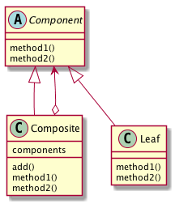

# Compositeパターン
-  Composite パターンは、「容器と中身を同一視する」ことで、再帰的な構造の取り扱いを容易にするもの
- 例：ファイルシステム
  - あるフォルダ以下のファイルやフォルダをすべて削除したい場合など、それがファイルなのかフォルダなのかを意識せずに、同じように削除できたほうが都合が良い

## 実際に使ってみる
### 題材
- サンプルケースでは、ディレクトリとファイルを考える。
- Composite パターンを意識せずに、ファイルとディレクトリを表すクラスを作成してみる。

```python
class File:
    def __init__(self, name):
        self._name = name

    def remove(self):
        print("{}を削除しました".format(self._name))
```

- ディレクトリを表す、Directory クラスは、List オブジェクトとして、配下のディレクトリとファイルのオブジェクトを管理し、remove メソッドが呼ばれた場合には、list に保持しているオブジェクトをすべて削除してから、自らを削除するものとする

```python
class Directory:
    def __init__(self, name):
        self._name = name
        self._list = []

    def add(self, arg):
        self._list.append(arg)

    def remove(self):
        itr = iter(self._list)

        i = 0

        while next(itr, None) is not None:

            obj = self._list[i]

            if isinstance(obj, File):
                obj.remove()
            elif isinstance(obj, Directory):
                obj.remove()
            else:
                print("削除できません")

            i += 1

        print("{}を削除しました".format(self._name))


if __name__ == "__main__":
    file1 = File("file1")
    file2 = File("file2")
    file3 = File("file3")
    file4 = File("file4")

    dir1 = Directory("dir1")
    dir1.add(file1)

    dir2 = Directory("dir2")
    dir2.add(file2)
    dir2.add(file3)

    dir1.add(dir2)
    dir1.add(file4)

    dir1.remove()
```

- ここまでは問題ない。ここに「ディレクトリには、ディレクトリとファイルだけでなくシンボリックリンクも入るようにしたい」という要求が出てくると面倒になる
- Composite パターンでは、容器の中身と入れ物を同一視する。同一視するために、容器と中身が共通のインタフェースを実装するようにする。
- File と Directory が共通のインタフェース DirectoryEntry を実装するようにする

```python
class DirectoryEntry(metaclass=ABCMeta):
    @abstractmethod
    def remove(self):
        pass
```

- DirectoryEntry インタフェースでは、remove メソッドのみを定義する
- これを実装する形でFileクラス、Directoryクラスを実装する。

```python
class File(DirectoryEntry):
    def __init__(self, name):
        self._name = name

    def remove(self):
        print("{}を削除しました".format(self._name))


class Directory(DirectoryEntry):
    def __init__(self, name):
        self._name = name
        self._list = []

    def add(self, entry: DirectoryEntry):
        self._list.append(entry)

    def remove(self):
        itr = iter(self._list)

        i = 0

        while next(itr, None) is not None:

            obj = self._list[i]
            obj.remove()

            i += 1

        print("{}を削除しました".format(self._name))
```

- Directory クラス、File クラスを共に DirectoryEntry クラスを実装するクラスとすることで、 Directory クラスの remove メソッド内では、実態が File クラスのインスタンスであるのか、Directory クラスのインスタンスであるのかを気にせず、どちらも DirectoryEntry オブジェクトとして扱うことができるようになっている。
- このように Composite パターンを利用していることで、SymbolicLink クラスを追加する必要が生じた場合も、 柔軟に対応できる。
  - DirectoryEntry インタフェースを 実装するように、SymbolicLink クラスを実装すればよい。

```python
class SymbolicLink(DirectoryEntry):
    def __init__(self, name):
        self._name = name

    def remove(self):
        print("{}を削除しました".format(self._name))
```


## Compositeパターンのまとめ

