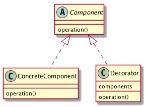

# Decoratorパターン
- Decorator パターンでは、飾り枠と中身を同一視することで、より柔軟な機能拡張方法を提供する。
- Decoratorパターンは機能を一つひとつかぶせていくイメージ。ある機能を持ったDecorationをコアとなるものにかぶせていくイメージである。

## 実際に使ってみる
### 題材
- アイスクリーム屋では、自由にトッピングを選べるようになっている。客は、トッピングしなくても良いし、複数のトッピングを重ねて選択することもできる。
- アイスクリーム共通のインタフェースとして、以下のインタフェースを定義する。

```python
class Icecream(metaclass=ABCMeta):

    @abstractmethod
    def get_name(self):
        pass

    @abstractmethod
    def how_sweet(self):
        pass

```

- これらのインタフェースを持つクラスとしては、バニラアイスクリームクラス、抹茶アイスクリームクラスなどが以下のように提供されている。

```python
class VanillaIcecream(Icecream):
    def get_name(self):
        return "バニラアイスクリーム"

    def how_sweet(self):
        return "バニラ味"


class GreenTeaIcecream(Icecream):
    def get_name(self):
        return "抹茶アイスクリーム"

    def how_sweet(self):
        return "抹茶味"
```

- これらのアイスクリームインタフェース実装クラスにトッピングをしていくことを考える。
- トッピングとしては、カシューナッツ、スライスアーモンドを考えてみる。
  - カシューナッツがトッピングされたバニラアイスクリームや、スライスアーモンドがトッピングされたバニラアイスクリームが要求される。
  - ここでは、トッピングを乗せることで、名前(getName メソッドの返り値)が変わり、味(howSweet() メソッドの返り値) は変わらないことにする。
- このような要求を満たすために、カシューナッツがトッピングされたバニラアイスクリームを表現するために、カシューナッツバニラアイスクリームクラスを作成する方法が考えられる。

```python
class CashewNutsVanillaIcecream(Icecream):
    def get_name(self):
        return "カシューナッツバニラアイスクリーム"

```

- このような「継承を利用した機能の追加」は、非常に固定的なものとなってしまう。
  - 例えば、カシューナッツを乗せた抹茶アイスクリームを表すインスタンスが欲しい場合は、抹茶アイスクリーム継承クラスが必要となる。
- Decorator パターンは、このように、様々な機能追加を柔軟に行いたい場合に威力を発揮する。
- Decorator パターンを利用した設計では、拡張機能部分のみを持たせた別クラスを用意し、 そのクラスのインスタンス変数に、拡張対象となるインスタンスを持たせ、 拡張対象と同じインタフェースを実装させる。

```python
class CashewNutsToppingIcecream(Icecream):

    def __init__(self, ice: Icecream):
        self._ice = ice

    def get_name(self):
        name = "カシューナッツ"
        name += self._ice.get_name()
        return name

    def how_sweet(self):
        return self._ice.how_sweet()
```

- CashewNutsToppingIcecream クラスは、カシューナッツがトッピングされたアイスクリームを表すクラス。
  - このクラスは、Icecream インタフェースを実装し、その getName() メソッドでは、自身が持つインスタンス変数 ice(Icecream インスタンス) の getName() で得られる値に「カシューナッツ」という文字列を付加した値を返り値として返す。また、howSweet() メソッドでは、インスタンス変数 ice の howSweet() メソッドの返り値をそのまま返している。
- このような設計とすることで、以下のように、カシューナッツがトッピングされたバニラアイスクリームも、カシューナッツがトッピングされた抹茶アイスクリームも、 スライスアーモンドがトッピングされたバニラアイスや、スライスアーモンドと、カシューナッツの両方がトッピングされたバニラアイスクリームなど、多様な組合せでのトッピングが可能になる。

```python
ice1 = CashewNutsToppingIcecream(VanillaIcecream())  # カシューナッツトッピングのバニラアイス
ice2 = CashewNutsToppingIcecream(GreenTeaIcecream())  # カシューナッツトッピングの抹茶アイス
```

## Decoratorパターンのまとめ

