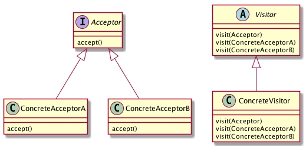

# Visitorパターン
- Visitor パターンでは、「処理」を訪問者である Visitor オブジェクトに記述することで、処理の追加を簡単にする。
- 処理対象となる、Acceptor オブジェクトは、Visitor オブジェクトを受け入れる accept(Visitor visitor)メソッドを実装している必要ある。
- 例
  - 家の「水道工事」を行ってもらう場合、「水道工事業者」を家に呼んで、「よろしくお願いします。」と言って、後は全てお任せする。
  - そのほかにも、電気工事業者を呼ぶことも、リフォーム業者を呼ぶこともある。
  - これらの訪問者に対して、あなたは、「では、よろしく」と言って、ほとんどの作業をお任せする
  - お任せの仕方に多少の違いがあるかもしれないが、最終的には、全てを業者にお任せすることになる。
  - もし、新しいサービスを提供する業者が現れたときにも、各家庭は、なんら態度を変える必要が無く、その業者を呼んで、「よろしくお願いします。」というだけで、その新しいサービスを受けることができる。
- Visitor パターンでは、このように、受け入れる側に処理を追加することなく、処理を追加することができるパターン。

## 実際に使ってみる
### 題材
- 家庭訪問を例に考える。
- 各家庭では、先生であろうと、近所のおばちゃんであろうと、訪問者が訪れると、知らない人でなければ、「いらっしゃい」と言って受け入れる。
- この際、各家庭を Acceptor 、先生を Visitor として、Visitor パターンに当てはめて考えてみる。
- Visitor パターンでは、Visitor は、訪問対象となる、家庭を訪問する。訪問された家庭は、「ようこそいらっしゃいました」と先生を受けいれる。
- このとき、新人だろうがベテランだろうが、先生を受け入れる側は変化がない。

```python
# -*- coding:utf-8 -*-
from abc import ABCMeta, abstractmethod


# 先生クラス
class Teacher(metaclass=ABCMeta):

    def __init__(self, students):
        self._students = students

    @abstractmethod
    def visit(self, student_home):
        getattr(self, 'visit_' + student_home.__class__.__name__.lower())(student_home)

    @abstractmethod
    def get_student_list(self):
        return self._students


# 新人先生クラス
class RookieTeacher(Teacher):

    def __init__(self, students):
        super().__init__(students)

    def visit(self, student_home):
        print("先生：こんにちは")
        super().visit(student_home)

    @staticmethod
    def visit_tanaka(tanaka):
        tanaka.praised_child()

    @staticmethod
    def visit_suzuki(suzuki):
        suzuki.reproved_child()

    def get_student_list(self):
        return self._students


# 家庭クラス
class Home(metaclass=ABCMeta):
    @staticmethod
    def praised_child():
        pass

    @staticmethod
    def reproved_child():
        pass


# 受け入れインタフェース
class TeacherAcceptor(metaclass=ABCMeta):

    def accept(self, teacher: Teacher):
        pass


# 鈴木さんの家庭
class Suzuki(Home, TeacherAcceptor):
    @staticmethod
    def praised_child():
        print("スズキ母：あら、先生ったらご冗談を")

    @staticmethod
    def reproved_child():
        print("スズキ母：うちの子に限ってそんなことは・・・。")

    def accept(self, teacher: Teacher):
        teacher.visit(self.__class__)


# 田中さんの家庭
class Tanaka(Home, TeacherAcceptor):
    @staticmethod
    def praised_child():
        print("タナカ母：あらあら、先生ったらご冗談を")

    @staticmethod
    def reproved_child():
        print("タナカ母：まさか、うちの子に限ってそんなことは・・・。")

    def accept(self, teacher: Teacher):
        teacher.visit(self.__class__)

if __name__ == "__main__":
    rt = RookieTeacher(["suzuki", "tanaka"])

    rt.visit(Suzuki())
    rt.visit(Tanaka())

```

- 各家庭のacceptメソッドが先生（visitor）のvisitメソッドを呼び出すことで、共通の処理を実現している

## Visitorパターンのまとめ


## 所感
- もっといい例がある気がする・・・
