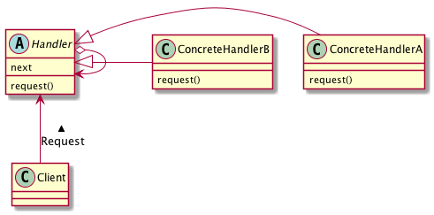

# Chain of Responsibilityパターン
- Chain of Respoisibility パターンとは、「責任」を負ったものが、「鎖」状につながれた状態をイメージさせるパターン
- 例：
  - 何かの決済を「課長」にお願いすると、課長決裁で対応できるものであれば、課長が決裁する。
  - 課長決済で対応できないものについては、「部長」に決裁をお願いすることになる。
  - 当然、部長が決裁できない内容のものであれば、より上位の決裁責任者に決裁が委ねられる。
- 「責任者」を「鎖状」につないでおき、「いずれかの段階」で、「誰か」が処理をすることを表現するようなパターン。


## 実際に使ってみる
### 題材
- 学校での決裁を考えてみる
- 生徒A「遠足のおやつはいくらまでですか？」
  - 新人先生「300円までです」 ← 新人先生の決裁
- 生徒B「バナナはおやつに入りますか？」
  - 新人先生「判断できない」
  - ベテラン先生「おやつに入りません」 ← ベテラン先生の決裁
- 生徒の親「携帯電話をもたせてもいいですか？」
  - 新人先生・ベテラン先生「判断できない」
  - 職員会議で決定 ← 更に上位の決裁

- 「責任を持つものが、自分の裁量で判断できるものに関しては自分で判断し、自分で判断できないものに関しては、次の責任者に判断を任せる」という連鎖

- Chain of Responsibility パターンを利用するには、「一般的な責任者を表すクラス」を作成し、それを継承する形で、生徒、新人先生、ベテラン先生、職員会議などのクラスを作成する
- 「一般的な責任者を表すクラス」は、「判断」するメソッドと、自分で判断できなかった場合に、判断を仰ぐ、「次の責任者」を表すフィールド変数をもつ
- 各責任者を表すクラスは、この「一般的な責任者を表すクラス」を継承して作成する

```python
# -*- coding:utf-8 -*-
from abc import ABCMeta, abstractmethod


class Responsible(metaclass=ABCMeta):

    def __init__(self, responsible_person: str):
        self._responsible_person = responsible_person
        self._next_level: Responsible = None

    @abstractmethod
    def set_next(self, next_level):
        self._next_level = next_level
        return self._next_level

    @abstractmethod
    def be_able_to_judge(self, question: Question) -> bool:
        pass

    @staticmethod
    @abstractmethod
    def judge(question: Question):
        pass

    @abstractmethod
    def put_question(self, question: Question):
        if self.be_able_to_judge(question):
            self.judge(question)
        elif self._next_level is not None:
            self._next_level.put_question(question)
        else:
            print("誰にも判断できませんでした。やってみなさい。")


class Question:
    """
    フィールドとして質問の内容を格納するString インスタンスと、
    質問の難易度を表す Level インスタンスを持つ。
    """

    def __init__(self, question: str, level: Level):
        self._question = question
        self._level = level


class Level:
    """
    フィールドとして難易度を表すint型の値と、
    自身の難易度と引数のLevelオブジェクトの難易度を比較するlessThan(Level level)メソッドを持つ
    """

    def __init__(self, level: int):
        self._level: int = level

    def less_than(self, level: Level):
        pass


class RookieTeachee(Responsible):

    def __init__(self, responsible_person):
        super().__init__(responsible_person)
        self._level = Level(2)

    def be_able_to_judge(self, question: Question):
        if question._level.less_than(self._level):
            return True

        return False

    @staticmethod
    def judge(question: Question):
        # ・・・

```

- 「責任者」それぞれを、クラスに分けてしまうことで、各責任者の役割を限定することができる。
- 責任者の役割を明確にし、責任者をクラスとして分割することで、より柔軟に、判断の流れである「鎖」を組み替えることができるようになる。
- 一方で、毎回鎖をたどっていくため、処理速度が遅くなることが考えられる。
- 速度重視のプログラムが必要なのか、柔軟性が求められるのか、状況によって判断する必要がある。

## Chain of Responsibilityパターンのまとめ

