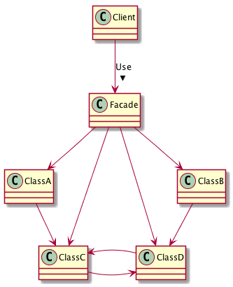

# Facadeパターン
- Facadeパターンは、既存のクラスを複数組み合わせて使う手順を、「窓口」となるクラスを作ってシンプルに利用できるようにするパターン

## 実際に使ってみる
### 題材
- 本を借りに図書館へ行ったがどこに何があるかわからない
- 所蔵本リストと、貸出帳があるが、使い方がわからない

```python
# -*- coding:utf-8 -*-


class BookList:
    """所蔵本リスト"""

    @staticmethod
    def search_book(book_name):
        location = None
        # 本の名前から探す
        # あればその場所を、なければnullを返す
        return location


class LendingList:
    """貸出帳"""

    @staticmethod
    def check(book_name):
        # 貸出帳をチェックする
        # 貸出中ならtrue、そうでなければfalseを返す
        return True


class Visitor:
    @staticmethod
    def main(args):
        # 借りたい本はどこにあるんだろう？
        # いつどこでどのメソッドを使うんだろう？
        pass

```

- 司書さんに聞く
  - これが「窓口」

```python
class Visitor:
    @staticmethod
    def main(args):
        # 窓口の司書さんに場所を聞く
        shisho = Librarian()
        location = shisho.search_book("昆虫図鑑")
        if location == "貸出中です":
            print("貸出中かよ！！")
        elif location == "その本は所蔵していません":
            print("無いんかい！！！")
        else:
            print("ありがとうございます")


class Librarian:
    @staticmethod
    def search_book(book_name):
        # 本を探す
        location = BookList.search_book(book_name)
        # 本の場所がNoneではない（所蔵してる）とき
        if location is not None:
            # 貸出中かチェックする
            if LendingList.check(book_name):
                # 貸出中のとき
                return "貸出中です"
            else:
                # 貸出中ではないとき
                return location
        else:
            # 所蔵していないとき
            return "その本は所蔵していません"
```

## Facadeパターンのまとめ

