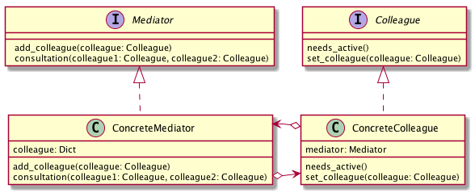

# Mediatorパターン
- 多数のオブジェクトの間の調整を行いながら処理をすすめる必要が ある場合に利用すると威力を発揮するパターン
- 例
  - 信号が壊れた交差点で交通整備する警官
  - 状況を判断して「止まれ」「進め」を指示する
- 複数のオブジェクト間の調整をするために、 各オブジェクトからの問い合わせを受け、 適宜判断を行い指示を出す「仲裁人」の役割を果たすクラスを利用するパターン

## 実際に使ってみる
### 題材
- マッチングアプリ
- 依頼に対して状況を見て回答する

```python
# -*- coding:utf-8 -*-


class Concierge:

    def __init__(self):
        self._user_dict = {}

    def add_user(self, user: User):
        self._user_dict[user.get_name()] = user

    @staticmethod
    def consultation(colleagueInLove: User, secretLover: User):
        possibility = 0
        # 様々な状況を考慮してpossibilityを導出
        return possibility


class User:
    def __init__(self):
        self._name = None

    def get_name(self):
        return self._name


class John(User):

    def __init__(self):
        super().__init__()
        self._name = "John"
        self._secret_lover = None
        self._tension = None
        self._mediator = Concierge()

    def get_name(self):
        return self._name

    def set_secret_lover(self, user: User):
        self._secret_lover = user

    def needs_advice(self):
        self._tension = self._mediator.consultation(self, self._secret_lover)

```

- Mediator パターンは、入力インタフェースなどに利用することができる。
- 例
  『複雑に絡み合ったある条件を満たさなければ「有効」にならないボタン』を作成したいとき
  - 「ラジオボタン Aが選択されている状態で、テキストボックスに入力がある場合」もしくは、 「ラジオボタンB が選択されている状態で、チェックボックス C もしくは D にチェックが入っている場合」 に「有効」になるボタンは、「ラジオボタン A」がチェックされたときに、 「テキストボックスに入力があるか」を検証したり、ラジオボタン B が選択されたときに 「チェックボックス C もしくは D がチェックされているか」を検証するようなプログラムにしていると、チェックボックス C にチェックが入れられたときや、チェックボックス D のチェックがはずされたときなども検証する必要があるプログラムになる。
  - 条件が複雑になるにつれ、どこで何をチェックしているのか管理できなくなってくるでしょう。
- Mediator パターンでは、各オブジェクトは、自分の状態が変わったときに、Mediator に連絡し、 Mediator は、状態が変わったオブジェクトだけでなく、各オブジェクトの状態を総合的に判断し、 「ボタン」を示すオブジェクトに、「有効」「無効」を伝えるような設計になり、管理が比較的楽になる。

## Mediatorパターンのまとめ

