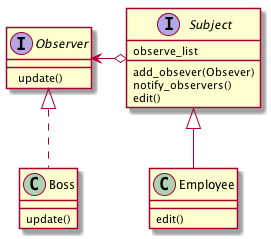
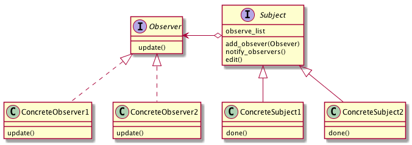

# Observerパターン
- 状態の変化を観察することを目的としたものであるが、どちらかというと「観察」よりも「通知」に重点の置かれたものになっている
- あるインスタンスの状態が変化した際に、そのインスタンス自身が、「観察者」に状態の変化を「通知」する仕組み。
- 例
  - 飛行機の搭乗券について考える。
  - 飛行機の搭乗券を購入した人がキャンセルする必要に駆られた場合、航空会社に連絡してキャンセルする旨を伝える。
  - 各搭乗者を管理しているのは「航空会社」で、キャンセルを伝えるのは「搭乗者」となる。
  - 「搭乗者」は、チケットが欲しくなったり、いらなくなったりしたら「航空会社」に連絡する。
  - このような仕組みによって、航空会社は全てのユーザを常に観察する必要がなくなる。

## 実際に使ってみる
### 題材
- 上司と部下たち
- 部下たちに成果物の作成を複数依頼
- その完成報告を上司に伝える

- Observerインタフェースを用意するところがキモ
  - Observer インタフェースでは、観察対象が変化した際に、観察対象からの通知を受ける窓口となる update メソッドを定義する
- 観察対象となる Subject 抽象クラスを作成
  - Observer インスタンスを自由に追加するためのadd_observer メソッドと、保持している Observer インスタンスの全てに変更を通知する notify_observers メソッドを実装する

## Observerパターンのまとめ

