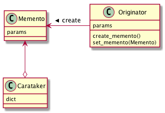

# Mementoパターン
- Memento: 記念品、形見
- インスタンスのあるときの状態をスナップショットとして保存しておくことで、 その時のインスタンスの状態を復元することを可能にするもの
- インスタンスの状態が、プログラム実行中にどんどん変化することが考えられる
- 一度変化してしまったインスタンスを、「少し前の状態に戻したい」「ある時点の状態に戻したい」などの要求が発生しうる
-  Memento パターンを使うと、インスタンスのある時の状態を、簡単にスナップショットとして残すことができ、 さらに、そこからの復元も可能になる
  - インスタンス全ての状態を覚えておくために、 clone を作成することもあるが、Memento パターンでは、必要な情報のみを保持しておき、必要なデータのみを復元することを考える

## 実際に使ってみる
### 題材
- 足し算
- 1〜5を足すと・・・
  - ```1+2+3+4+5=15```
- 次に、1~10を足すと・・・？
  - パターン１：```1+2+3+4+5+6+7+8+9+10=55```
  - パターン２：```15+6+7+8+9+10=55```
- パターン２の方がMementoパターン
- これをコードにする

```python
# -*- coding:utf-8 -*-


class Memento:
    """途中経過を保持する Memento クラス"""
    result = -1 # 計算の途中経過を表す

    def __init__(self, temp):
        """計算経過を引数に受け取るコンストラクタ"""
        Memento.result = temp


class Calc:
    """ひとつの計算を表すクラス。"""
    temp = 0

    @staticmethod
    def plus(plus):
        """足し算を実行するメソッド"""
        Calc.temp += plus

    @staticmethod
    def create_memento():
        """途中経過を Memento として取得するメソッド"""
        return Memento(Calc.temp)

    @staticmethod
    def set_memento(memento: Memento):
        """Memento から計算経過を取得して、temp にセットする"""
        Calc.temp = memento.result

    @staticmethod
    def get_temp():
        """計算結果を取得するメソッド"""
        return Calc.temp


class Calculator:

    def __init__(self):
        self.result_dict = {}

    def run(self):
        c = Calc()

        # 1回目の計算
        for i in range(1, 6):
            c.plus(i)

        print(f"5までの足し算: {c.get_temp()}")
        self.result_dict["5までの足し算"] = c.create_memento()

        # 2回目の計算
        c2 = Calc()
        c2.set_memento(self.result_dict["5までの足し算"])

        # 1回目の計算
        for i in range(6, 11):
            c2.plus(i)

        print(f"10までの足し算: {c2.get_temp()}")
        self.result_dict["10までの足し算"] = c2.get_temp()


if __name__ == '__main__':
    c = Calculator()
    c.run()
```
- ある段階のものを「スナップショット」として残しておくことで、その時の状態にすばやく戻すことができる
- Memento パターンでは、何の値を Memento として残すべきか、Originator(ここでは Calc) に委ねられている。
- Originator は、必要と思われる情報を Memento として残し、Memento から状態を復元する

## Mementoパターンのまとめ

