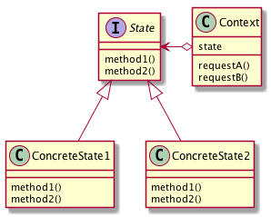

# Stateパターン
- オブジェクト指向設計では、モノをクラスとして表現することが多くある
- モノではなく、「状態」をクラスとして表現するパターン

## 実際に使ってみる
### 題材
- 職場での会話
- 上司の機嫌によってタスクの振り方が変わる（そんな職場嫌だ...）
- 機嫌がいいとき
```
部下：おはようございます
上司：おはよう
部下：今日はxxxやります
上司：いいね、がんばって
```
- 機嫌が悪いとき
```
部下：おはようございます
上司：おう
部下：今日はxxxやります
上司：おい、oooやれって言ったよな？やったのか？
部下：（聞いてないっす・・・）すみません、すぐやります！！！！！！！！
```
- コードにする

```python
# -*- coding:utf-8 -*-


class Boss:
    STATE_ORDINARY = 0  # 通常時の上司
    STATE_IN_BAD_MOOD = 1   # 機嫌の悪い上司

    def __init__(self):
        self.state = -1  # 上司の状態を表す

    def change_state(self, state):
        """上司の状態を変更する"""
        self.state = state

    def morning_greet(self):
        """朝の挨拶を返す"""
        if self.state == Boss.STATE_ORDINARY:
            return "おはよう"
        elif self.state == Boss.STATE_IN_BAD_MOOD:
            return "おう"
        else:
            pass

    def assign_task(self):
        """タスクを振る"""
        if self.state == Boss.STATE_ORDINARY:
            return "いいね、がんばって"
        elif self.state == Boss.STATE_IN_BAD_MOOD:
            return "おい、oooやれって言ったよな？やったのか？"
        else:
            pass

```

- 上司の上司から指摘が入り、もっとちゃんとしたマネジメントをするようになったとする → 新たなパターンが生まれた
- if分岐に手を入れていくのはイケてない
- State パターンでは、「状態」を表すクラスを用意し、この「状態」を入れ替え可能にしておく。
- サンプルケースであれば、まずは、「ご機嫌斜め状態」「普通の状態」が必要となる。
- State の変更は、どのクラスが行っても良いのですが、今回のケースでは、内部のどこかから変更されるものとしてみる。

```python
# -*- coding:utf-8 -*-
from abc import ABCMeta, abstractmethod


class State(metaclass=ABCMeta):

    @staticmethod
    def morning_greet():
        """朝の挨拶"""
        pass

    @staticmethod
    def assign_task():
        """タスクを振る"""
        pass


class BadMoodState(State):

    @staticmethod
    def morning_greet():
        return "おう"

    @staticmethod
    def assign_task():
        return "おい、oooやれって言ったよな？やったのか？"


class OrdinaryState(State):

    @staticmethod
    def morning_greet():
        return "おはよう"

    @staticmethod
    def assign_task():
        return "いいね、がんばって"


class StatePatternBoss:

    def __init__(self):
        self.state = None

    def change_state(self, state: State):
        self.state = state

    def morning_greet(self):
        return self.state.morning_greet()

    def assign_task(self):
        return self.state.assign_task()


if __name__ == '__main__':

    boss_state = StatePatternBoss()

    print("===== 1日目：機嫌よし =====")
    boss_state.change_state(OrdinaryState())
    print("部下：おはようございます")
    print(f"上司：{boss_state.morning_greet()}")
    print("部下：今日はxxxやります")
    print(f"上司：{boss_state.assign_task()}")

    print("===== 2日目：機嫌悪い =====")
    boss_state.change_state(BadMoodState())
    print("部下：おはようございます")
    print(f"上司：{boss_state.morning_greet()}")
    print("部下：今日はxxxやります")
    print(f"上司：{boss_state.assign_task()}")

```
```
===== 1日目：機嫌よし =====
部下：おはようございます
上司：おはよう
部下：今日はxxxやります
上司：いいね、がんばって
===== 2日目：機嫌悪い =====
部下：おはようございます
上司：おう
部下：今日はxxxやります
上司：おい、oooやれって言ったよな？やったのか？
```
- こうすることで、ご機嫌パターンが増えても対応が楽

```python
(前略)
class GoodMoodState(State):

    @staticmethod
    def morning_greet():
        return "おはよう！今日も頑張ろう！"

    @staticmethod
    def assign_task():
        return "いいね！こないだのoooもいい感じだったよ！この調子で頑張ってね！"
（中略）
    print("===== 3日目：機嫌良い =====")
    boss_state.change_state(GoodMoodState())    # ここを変更するだけ
    print("部下：おはようございます")
    print(f"上司：{boss_state.morning_greet()}")
    print("部下：今日はxxxやります")
    print(f"上司：{boss_state.assign_task()}")
```
```
===== 3日目：機嫌良い =====
部下：おはようございます
上司：おはよう！今日も頑張ろう！
部下：今日はxxxやります
上司：いいね！こないだのoooもいい感じだったよ！この調子で頑張ってね！
```

## Stateパターンのまとめ

