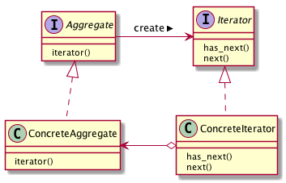

# Iteratorパターン
- 要素の集まりを保有するオブジェクトの各要素に順番にアクセスする方法を提供するためのパターン
  - 例：Listクラス（要素として複数のオブジェクトを持つことができるもの）
    - このクラスのオブジェクトに順番にアクセスしたいとき、その走査方法は複数考えられるが、あらかじめすべてを洗い出すことは不可能
      - アルファベット順、パラメータを使うetc.
    - 走査方法を与えるクラスをListクラスとは別に独立しておくと、ユーザは独自で走査クラスを作成することができる

## 実際に使ってみる
### 題材
- 会社の上司と部下の関係
- 部下は5人
- 部下を表すクラス：

```python
class Employee:

    def __init__(self, name, sex):
        self._name = name
        self._sex = sex

    def get_name(self):
        return self._name

    def get_sex(self):
        return self._sex
```
- 部下は名前と性別を持ち、名前を返すメソッドと性別を返すメソッドを持つ
- 部下を管理するための名簿：

```python
class EmployeeList:

    def __init__(self, employee_count):
        self._employees = [0] * employee_count
        self._last = 0

    def add(self, employee):
        self._employees[self._last] = employee
        self._last += 1

    def get_employee_at(self, idx):
        return self._employees[idx]

    def get_last_num(self) -> int:
        return self._last
```
- この名簿は自由に拡張可能
- 上司の持つ能力とそれを表現するコード：
    - 与えられた名簿に自分の部下を追加できる
    - 名簿順に部下を呼ぶことができる

```python
class Boss(metaclass=ABCMeta):

    def __init__(self):
        self._employeesList = None

    @abstractmethod
    def create_employee_list(self):
        pass

    @abstractmethod
    def call_employee(self):
        pass
```

- これに対し、5人の部下を名簿に追加し、追加した順番に名前を呼び出すプログラムを作成する


### 実装１：デザインパターンを意識しない
```python
class MyBoss(Boss):

    def __init__(self):
        super(MyBoss, self).__init__()

    def create_employee_list(self):
        self._employeesList = EmployeeList(5)
        self._employeesList.add(Employee("Tom", 1))
        self._employeesList.add(Employee("Mary", 2))
        self._employeesList.add(Employee("Sam", 1))
        self._employeesList.add(Employee("John", 1))
        self._employeesList.add(Employee("Ann", 2))

    def call_employee(self):
        size = self._employeesList.get_last_num()
        for i in range(size):
            print(self._employeesList.get_employee_at(i).get_name())


def main():
    you = MyBoss()
    you.create_employee_list()
    you.call_employee()


if __name__ == "__main__":
    main()

```


### Iteratorパターンの考え方
- 動くものはできたが、これでは変更に強くない
- 例えば名簿（EmployeeListクラス）が変更された場合に、MyBossクラスは変更を余儀なくされる
- EmployeeListクラスの変更例：

```python
class NewEmployeeList:

    def __init__(self):
        self._employees = []  # 可変長

    def add(self, employee):
        self._employees.append(employee)

    def get_employee_at(self, idx):
        return self._employees[idx]
```

- Iteratorパターンを導入する
- Iteratorパターンでは何らかの集約体が必ずAggregateインタフェースを実装する
- Aggregate インタフェースでは `iterator()` メソッド（Iteratorインタフェースの実装クラスを返す）のみ定義する
- 集約体を操作するために必要なメソッドとして、この集約体に次の要素が存在するかどうかをboolean型で返す `has_next()` メソッドと、次の要素を返す `next()` メソッドを定義する。

```python:Aggregateクラス
class Aggregate(metaclass=ABCMeta):

    @abstractmethod
    def iterator(self):
        pass
```

```python:Iteratorクラス
class Iterator(metaclass=ABCMeta):

    @abstractmethod
    def has_next(self):
        pass

    @abstractmethod
    def next(self):
        pass
```

- 今回の例だと、集約体はEmployeeListクラスを拡張したもの（MyEmployeeListクラスとする）
- このクラスはAggregateインタフェースを実装する必要がある

```python:MyEmployeeListクラス
class MyEmployeeList(EmployeeList, Aggregate):
  def iterator:
    return hoge # iterateorオブジェクトを返す
```

- また、Iteratorクラスの実装クラス（MyEmployeeIteratorクラス）も必要

```python:MyEmployeeListクラス
class MyEmployeeList(Iterator):

  def has_next():
      return foo # boolean

  def next():
      return var # Employeeオブジェクト
```

- [実装１](#実装１：デザインパターンを意識しない)では、 `call_employee()` メソッドが集約体のメソッド（ `get_last_num()` ）に依存するなど、集約体が変更されたときに合わせて修正が必要となっている
- Iteratorパターンに合わせて実装すると、集約体に依存する必要がなくなる

```python:Iteratorを使ったときのcall_employeeメソッド（イメージ）
def call_employee():
  irt = EmployeeList.iterator()
  while itr.has_next():
    print(itr.next().get_name())
```

### 実装２：デザインパターンを意識する
- 上記を踏まえて実装すると以下のようになる

```python
# -*- coding:utf-8 -*-
from abc import ABCMeta, abstractmethod


class Employee:

    def __init__(self, name, sex):
        self._name = name
        self._sex = sex

    def get_name(self):
        return self._name

    def get_sex(self):
        return self._sex


class NewEmployeeList:

    def __init__(self):
        self._employees = []  # 可変長

    def add(self, employee):
        self._employees.append(employee)

    def get_employee_at(self, idx):
        return self._employees[idx]


class Boss(metaclass=ABCMeta):

    def __init__(self):
        self._employeesList = None

    @abstractmethod
    def create_employee_list(self):
        pass

    @abstractmethod
    def call_employee(self):
        pass

# ここまでが事前に提供されるもの


class Aggregate(metaclass=ABCMeta):

    @abstractmethod
    def iterator(self):
        pass


class Iterator(metaclass=ABCMeta):

    @abstractmethod
    def has_next(self):
        pass

    @abstractmethod
    def next(self):
        pass


class MyEmployeeList(NewEmployeeList, Aggregate): # EmployeeListが変更されたら修正

    def __init__(self):
        super(MyEmployeeList, self).__init__()

    def iterator(self):
        return MyEmployeeIterator(self)

    def get_list_len(self):
        return len(self._employees)


class MyEmployeeIterator(Iterator): # EmployeeListが変更されたら修正

    def __init__(self, employee_list):
        self._index = 0
        self._my_employee_list = employee_list

    def has_next(self):
        if self._my_employee_list.get_list_len() > self._index:
            return True
        else:
            return False

    def next(self):
        emp = self._my_employee_list.get_employee_at(self._index)
        self._index += 1
        return emp

# ここまでがIteratorパターンのために実装したもの


class GoodBoss(Boss): # EmployeeListが変更されても修正の必要がない

    def __init__(self):
        super(GoodBoss, self).__init__()

    def create_employee_list(self):
        self._employeesList = MyEmployeeList()
        self._employeesList.add(Employee("Tom", 1))
        self._employeesList.add(Employee("Mary", 2))
        self._employeesList.add(Employee("Sam", 1))
        self._employeesList.add(Employee("John", 1))
        self._employeesList.add(Employee("Ann", 2))

    def call_employee(self):
        itr = self._employeesList.iterator()
        while itr.has_next():
            print(itr.next().get_name())


def main():
    you = GoodBoss()
    you.create_employee_list()
    you.call_employee()


if __name__ == "__main__":
    main()

```

## Iteratorパターンのまとめ
- Iteratorパターンは集約オブジェクトの種類や実装に依存しない、統一的な走査方法を提供したいような場合に利用するとよい
- Iteratorパターンのクラス図は以下のようになる


