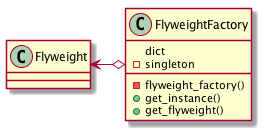

# Flyweightパターン
- Flyweight：英語で「フライ級」を意味
- インスタンスを共有することでリソースを無駄なく使うことに焦点を当てたパターン
- 例：
  ホームページの背景に使う小さな画像は、背景で表示される回数分ネットワークごしにやり取りされるわけではなく、通常、画像を一回取得し、「その画像」を並べて表示する
- 同じインスタンスを共有することで、無駄なインスタンスを生成しないようにして、 プログラム全体を軽くすることを目的としたパターン

## 実際に使ってみる
### 題材
- 「人文字」を使ったメッセージをつくってみる
  - 「あいはあおよりもあおい」
- 一文字ずつ「人文字」で作って屋上から撮影し写真に残していく。
- 一文字の人文字を表すクラスを HumanLetter クラスとすると、 人文字でメッセージを生成するクラスは、以下のようになる

```python
# -*- coding:utf-8 -*-


class HumanLetter:

    def __init__(self, letter):
        self._letter = letter

    def get_letter(self):
        return self._letter


class Main:

    @staticmethod
    def take_a_photo(letter: HumanLetter):
        """写真を取る"""
        print(letter.get_letter())

    def main(self):
        """一文字を作成する"""
        a = HumanLetter("あ")
        self.take_a_photo(a)

        i = HumanLetter("い")
        self.take_a_photo(i)

        ha = HumanLetter("は")
        self.take_a_photo(ha)

        a2 = HumanLetter("あ")
        self.take_a_photo(a2)

        o = HumanLetter("お")
        self.take_a_photo(o)

        yo = HumanLetter("よ")
        self.take_a_photo(yo)

        ri = HumanLetter("り")
        self.take_a_photo(ri)

        mo = HumanLetter("も")
        self.take_a_photo(mo)

        a3 = HumanLetter("あ")
        self.take_a_photo(a3)

        o2 = HumanLetter("お")
        self.take_a_photo(o2)

        i2 = HumanLetter("い")
        self.take_a_photo(i2)


if __name__ == '__main__':
    h = Main()
    h.main()

```
- 同じ文字が何度も出てくる。
- 写真を取るだけなら使いまわしできるので...

```python
# -*- coding:utf-8 -*-


class HumanLetter:

    def __init__(self, letter):
        self._letter = letter

    def get_letter(self):
        return self._letter


class Main:

    @staticmethod
    def take_a_photo(letter: HumanLetter):
        """写真を取る"""
        print(letter.get_letter())

    def main(self):
        """一文字を作成する"""
        a = HumanLetter("あ")
        self.take_a_photo(a)

        i = HumanLetter("い")
        self.take_a_photo(i)

        ha = HumanLetter("は")
        self.take_a_photo(ha)

        self.take_a_photo(a)

        o = HumanLetter("お")
        self.take_a_photo(o)

        yo = HumanLetter("よ")
        self.take_a_photo(yo)

        ri = HumanLetter("り")
        self.take_a_photo(ri)

        mo = HumanLetter("も")
        self.take_a_photo(mo)

        self.take_a_photo(a)

        self.take_a_photo(o)

        self.take_a_photo(i)


if __name__ == '__main__':
    h = Main()
    h.main()

```

- コストのかかるインスタンス化(ここでは人を並び替えて文字を形成するコンストラクタ。 本来ならＤＢアクセスなどが考えられれる。)の回数を少しへらすことができた。 当然インスタンスの数も減っている。
- Flyweight パターンで更に減らす
- 軽量化されるべきインスタンスの生成や管理を行う Factory クラスを作成し、 軽量化されるべきインスタンスは、この Factory クラスを介して取得するようにする

```python
# -*- coding:utf-8 -*-


class HumanLetter:

    def __init__(self, letter):
        self._letter = letter

    def get_letter(self):
        return self._letter


class HumanLetterFactory:
    __singleton = None
    __human_letter = None

    def __new__(cls, *args, **kwargs):
        if cls.__singleton is None:
            cls.__singleton = super(HumanLetterFactory, cls).__new__(cls)
        return cls.__singleton

    def __init__(self):
        self.dic = {}

    def get_human_letter(self, letter: str):

        try:
            human_letter = self.dic[letter]
        except KeyError:
            human_letter = HumanLetter(letter)
            self.dic[letter] = human_letter

        return human_letter


class Main:

    @staticmethod
    def take_a_photo(letter: HumanLetter):
        """写真を取る"""
        print(letter.get_letter())

    def main(self):
        """一文字を作成する"""

        # singleton作成
        hlf = HumanLetterFactory()

        a = hlf.get_human_letter("あ")
        self.take_a_photo(a)
        print(a)

        i = hlf.get_human_letter("い")
        self.take_a_photo(i)
        print(i)

        ha = hlf.get_human_letter("は")
        self.take_a_photo(ha)

        a2 = hlf.get_human_letter("あ")
        self.take_a_photo(a2)
        print(a2)

        o = hlf.get_human_letter("お")
        self.take_a_photo(o)
        print(o)

        yo = hlf.get_human_letter("よ")
        self.take_a_photo(yo)

        ri = hlf.get_human_letter("り")
        self.take_a_photo(ri)

        mo = hlf.get_human_letter("も")
        self.take_a_photo(mo)

        a3 = hlf.get_human_letter("あ")
        self.take_a_photo(a3)
        print(a3)

        o2 = hlf.get_human_letter("お")
        self.take_a_photo(o2)
        print(o2)

        i2 = hlf.get_human_letter("い")
        self.take_a_photo(i2)
        print(i2)


if __name__ == '__main__':
    h = Main()
    h.main()

```
```
あ
<__main__.HumanLetter object at 0x1039c4da0> #「あ」で共通のインスタンスになっている
い
<__main__.HumanLetter object at 0x1039c4dd8>
は
あ
<__main__.HumanLetter object at 0x1039c4da0>  #「あ」で共通のインスタンスになっている
お
<__main__.HumanLetter object at 0x1039c4e48>
よ
り
も
あ
<__main__.HumanLetter object at 0x1039c4da0> #「あ」で共通のインスタンスになっている
お
<__main__.HumanLetter object at 0x1039c4e48>
い
<__main__.HumanLetter object at 0x1039c4dd8>
```

- Factory クラスを Singleton にすることで、複数の Factory クラスが生成されてしまうことを防ぐ
  - [Singleton](../05_Singleton)
-  HumanLetterFactory クラスの get_human_letter メソッドでは、管理している dict に照会し、すでに持っている 文字を表すインスタンスが必要な際は、わざわざ新しく作り直すことはない
- もっていない文字を求められた場合は、新たにインスタンス化し、map に登録の上、生成したインスタンスを返す
- Flyweight パターンを利用することで、どのインスタンスを持っているのかなどを、利用者(Main クラスのような呼び出し側) で把握しておく必要がなくなる。また、複数の呼び出し先からの要求にも無駄なく応えることが可能となる。
- 注意
  - Flyweight パターンは、ひとつのインスタンスを各所で共有することになりため、 共有されるインスタンスが本質的(intrinsic)な情報のみを持つ場合にのみ利用するべき。
    - DBのコネクションとか
  - 非本質的(extrinsic)な情報は、どこかの誰かが変更する可能性のあるものであり、 共有するインスタンスを勝手に誰かが変更することで、そこかしこに影響を与えることになりかねない。

## Flyweightパターンのまとめ

