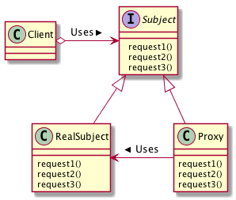

# Proxyパターン
- Proxy: 代理人
- 代理人オブジェクトは、本人でなくてもできるような処理を任される。
- 代理人オブジェクトでできない処理は本人オブジェクトが引き受け、処理する。

## 実際に使ってみる
### 題材
- 営業としてお客様折衝をしている田中さん
- お客様からいくつか質問を受けたが、答えられないものがあり自社持ち帰り
- 自社で上司の鈴木さんに確認し、改めてお客様へ回答した
- 代理人オブジェクト：田中さん
- 本人オブジェクト：鈴木さん

```python
# -*- coding:utf-8 -*-
from abc import ABCMeta, abstractmethod


class Sales(metaclass=ABCMeta):
    """営業interface"""

    def __init__(self):
        pass

    @staticmethod
    @abstractmethod
    def question1():
        pass

    @staticmethod
    @abstractmethod
    def question2():
        pass

    @staticmethod
    @abstractmethod
    def question3():
        pass


class Suzuki(Sales):
    """鈴木さんクラス（本人オブジェクト）"""

    @staticmethod
    def question1():
        print("回答１")

    @staticmethod
    def question2():
        print("回答２")

    @staticmethod
    def question3():
        print("回答３")


class Tanaka(Sales):
    """田中さんクラス（代理人オブジェクト）"""

    @staticmethod
    def question1():
        print("それは「回答１」です")

    @staticmethod
    def question2():
        print("それは「回答２」です")

    @staticmethod
    def question3():
        print("それは「")
        # 答えられないので鈴木先生に聞く
        Suzuki().question3()
        print("」になります")


class Client:
    """お客様クラス"""

    @staticmethod
    def main():
        # 質問１
        Tanaka().question1()

        # 質問２
        Tanaka().question2()

        # 質問３
        Tanaka().question3()


if __name__ == '__main__':
    c = Client()
    c.main()

```

```
それは「回答１」です
それは「回答２」です
それは「
回答３
」になります
```

## Proxyパターンのまとめ

