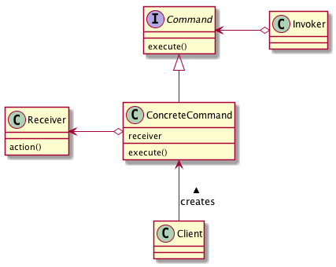

# Commandパターン
- あるオブジェクトに対して要求を送るということは、そのオブジェクトのメソッドを呼び出すことと同じ。
- メソッドにどのような引数を渡すか、ということによって要求の内容は表現される。
- さまざまな要求を送ろうとすると、引数の数や種類を増やさなければならない。
- 要求自体をオブジェクトにしてしまい、そのオブジェクトを引数に渡すようにする。
- 要求をCommandオブジェクトにして、それらを複数組み合わせて使えるようにするパターン。

## 実際に使ってみる
### 題材
- 理科の授業で、「水100gに食塩は何g溶けるか」という飽和食塩水の実験を行うことにした。手順は以下のとおり。

#### 水100gに食塩を1gずつ加えて飽和食塩水を作る実験

1. ビーカーに水を100g入れる
1. ビーカーに食塩を1g入れる
1. かき混ぜる
1. 完全に溶ければ、2に戻る
1. 食塩が溶け残ったら、そのときの水量、食塩量、濃度を記録する

- また、「食塩10gをすべて溶かすには水は何g必要か」という実験も行う。手順は以下のとおり。

#### 食塩10gに水を10gずつ加えて飽和食塩水を作る実験

1. ビーカーに食塩を10g入れる
1. ビーカーに水を10g入れる
1. かき混ぜる
1. 完全に溶けなければ、2に戻る
1. 食塩が完全に溶けたら、そのときの水量、食塩量、濃度を記録する

- 生徒全員に実験方法を記述させるのは大変なので、実験方法が載っている実験セットを用意し、それを生徒に渡し、実験させることにする。

```python
# -*- coding:utf-8 -*-

ADD_SALT = 1  # 食塩を加えて、かき混ぜる場合
ADD_WATER = 2  # 水を加えて、かき混ぜる場合


class Beaker:
    """実験セット"""

    def __init__(self, water: float, salt: float):
        self._water = water
        self._salt = salt
        self._melted = False
        self.mix()

    def mix(self):
        """
        溶液をかき混ぜるメソッド
        溶けたか溶け残ったかをセットする
        常温の飽和食塩水の濃度は約26.4%
        """
        if self.get_density() < 26.4:
            self._melted = True
        else:
            self._melted = False

    def is_melted(self) -> bool:
        return self._melted

    def add_salt(self, salt: float):
        self._salt += salt

    def add_water(self, water: float):
        self._water += water

    def get_density(self):
        return (self._salt/(self._water + self._salt))*100

    def note(self):
        print(f"水：{self._water}g")
        print(f"食塩：{self._salt}g")
        print(f"濃度：{self.get_density()}%")

    def experiment(self, param: int):
        """実験を行うメソッド"""
        if param == ADD_SALT:
            # 食塩を1gずつ加えて飽和食塩水を作る実験をする場合
            # 完全に溶けている間は食塩を加える

            while self.is_melted():
                self.add_salt(1)  # 食塩を1g入れる
                self.mix()  # かき混ぜる

            print("食塩を1gずつ加える実験")
            self.note()

        elif param == ADD_WATER:
            # 水を10gずつ加えて飽和食塩水を作る実験をする場合
            # 溶け残っている間は水を加える

            while not self.is_melted():
                self.add_water(10)  # 水を10g入れる
                self.mix()  # かき混ぜる

            print("水を10gずつ加える実験")
            self.note()


class Student:
    """実験する生徒"""

    def main(self):
        # 水100gに食塩を1gずつ加えて飽和食塩水を作る実験
        Beaker(100, 0).experiment(ADD_SALT)

        # 食塩10gに水を10gずつ加えて飽和食塩水を作る実験
        Beaker(0, 10).experiment(ADD_WATER)


if __name__ == '__main__':
    s = Student()
    s.main()

```

- ここで追加の実験（濃度10%の食塩水100gを作る実験）を行おうとすると、実験セットクラスの実験を行うメソッドを修正しなければならない

```python
MAKE_SALT_WATER = 3  #食塩水を作る場合
# ...
class Beaker:
  # ...
  def experiment(self, param: int):
      """実験を行うメソッド"""
      if param == ADD_SALT:
        # ...

      elif param == ADD_WATER:
        # ...

      elif param == MAKE_SALT_WATER:
          # 食塩水を作る実験
          self.mix()
          # 濃度を測り、ノートに記述する
          print("食塩水を作る実験")
          self.note()
  # ...
```

- 実験のパターンを増やすと実験セットクラスにif文を追加することになり、またパラメータも増やさなければならず、拡張性が悪い
- 実験の内容をintで表すことをやめて、実験そのものを1つのCommandオブジェクトで表現するようにする
- 実験内容、つまりCommandオブジェクトに共通のインターフェースを持たせることにより、実験セットクラスは、どんな種類の実験内容(Commandオブジェクト)を受け取っても、共通の実験を行うメソッドを実行すれば良いことになる。

```python:実験コード
# -*- coding:utf-8 -*-
from abc import ABCMeta, abstractmethod


class Beaker:
    """実験セット"""

    def __init__(self, water: float, salt: float):
        self._water = water
        self._salt = salt
        self._melted = False
        self.mix()

    def mix(self):
        """
        溶液をかき混ぜるメソッド
        溶けたか溶け残ったかをセットする
        常温の飽和食塩水の濃度は約26.4%
        """
        if self.get_density() < 26.4:
            self._melted = True
        else:
            self._melted = False

    def is_melted(self) -> bool:
        return self._melted

    def add_salt(self, salt: float):
        self._salt += salt

    def add_water(self, water: float):
        self._water += water

    def get_density(self):
        return (self._salt/(self._water + self._salt))*100

    def note(self):
        print(f"水：{self._water}g")
        print(f"食塩：{self._salt}g")
        print(f"濃度：{self.get_density()}%")
```

```python:共通インターフェース
class Command(metaclass=ABCMeta):
    """実験内容を表すクラスの共通インターフェースを提供するスーパークラス"""

    def __init__(self):
        self._beaker = None

    def set_beaker(self, beaker: Beaker):
        self._beaker = beaker

    def execute(self):
        pass
```

```python:各実験内容クラス（Commandオブジェクト）
class AddSaltCommand(Command):
    """食塩を1gずつ加える実験のコマンドクラス"""

    def execute(self):
        while self._beaker.is_melted():
            self._beaker.add_salt(1)
            self._beaker.mix()

        print("食塩を1gずつ加える実験")
        self._beaker.note()


class AddWaterCommand(Command):
    """水を10gずつ加える実験のコマンドクラス"""

    def execute(self):
        while not self._beaker.is_melted():
            self._beaker.add_water(10)
            self._beaker.mix()

        print("水を10gずつ加える実験")
        self._beaker.note()


class MakeSaltWaterCommand(Command):
    """食塩水を作る実験のコマンドクラス"""

    def execute(self):
        self._beaker.mix()

        print("食塩水を作る実験")
        self._beaker.note()
```

```python:生徒クラス
class Student:
    """実験する生徒"""

    def main(self):
        add_salt = AddSaltCommand()
        add_salt.set_beaker(Beaker(100, 0))  # 水100g入ったビーカーを用意する

        add_water = AddWaterCommand()
        add_water.set_beaker(Beaker(10, 10))  # 食塩10g入ったビーカーを用意する

        make_saltwater = MakeSaltWaterCommand()
        make_saltwater.set_beaker(Beaker(90, 10))  # 水90g、食塩10g入ったビーカーを用意する

        add_salt.execute()  # 水100gに食塩を1gずつ加えて飽和食塩水を作る実験

        add_water.execute()  # 食塩10gに水を10gずつ加えて飽和食塩水を作る実験

        make_saltwater.execute()  # 10%の食塩水100gを作る実験

```

- Commandパターンを適用すると、実験セットのソースコードを変更しなくても、いろいろな実験を追加することができる。
- また、既存の実験内容を組み合わせて、新たな実験を作ることも可能となる。
- 新しい実験内容のexecuteメソッド内に、既存の実験内容のexecuteメソッドを記述すれば、新しい実験内容が実行された際、記述した順に既存の実験内容も実行される。
- 再利用性も高くなる。

## Commandパターンのまとめ

