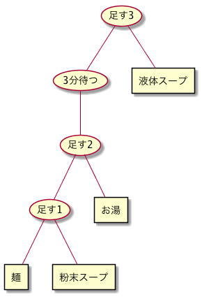
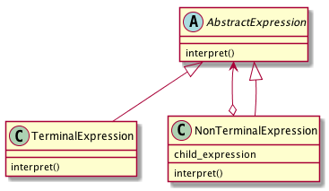

# Interpreterパターン
- Interpreter: 解釈者・説明者
-  何らかのフォーマットで書かれたファイルの中身を、解析した結果に則って何らかの処理を行いたい場合がある。
- Interpreter パターンとは、このような「解析した結果」得られた手順に則った処理を実現するために最適なパターン。

## 実際に使ってみる
### 題材
- カップラーメンの作り方で考える
- 工程は以下の通り
  1. カップめんに「粉末スープ」を入れる
  2. お湯を注ぐ
  3. 3分待つ
  4. 液体スープを入れる
- 構文木にすると以下の通り  

- この構文木から「処理」と「処理対象」を抜き出してみる。
- 「処理」に分類されるものは、「足す」「3分待つ」の2つ。
- 一方「処理対象」に分類されるものは、 「粉末スープ」「麺」「お湯」「液体スープ」だけでなく「粉末スープと麺を足したもの」 「粉末スープと麺を足したものにお湯を足したもの」「粉末スープと麺を足したものにお湯を足したものを3分置いたもの」 なども、処理対象と考えられる。
- このように、「処理対象」には「処理結果」も含まれるため、この2つを同一視するために、 Interpreter パターンは Composit パターンと同じ構造をとる。

```python
# -*- coding:utf-8 -*-
from abc import ABCMeta, abstractmethod


class Operand(metaclass=ABCMeta):
    """処理対象を表すインタフェース"""
    @abstractmethod
    def get_operand_string(self):
        pass

```

- 「処理対象」「処理結果」を表すクラスは、このインタフェースを実装する

```python
class Ingredient(Operand):
    """処理対象を表すクラス"""

    def __init__(self, operand_string: str):
        self._operand_string = operand_string

    def get_operand_string(self) -> str:
        return self._operand_string


class Expression(Operand):
    """処理結果を表すクラス"""

    def __init__(self, operator):
        """処理内容を表す operator を引数に取る"""
        self._operand_string = None
        self._operator = operator

    def get_operand_string(self):
        return self._operator.execute().get_operand_string()

```

- 処理を表すインタフェースと実装クラスは、以下のようになる

```python
class Operator(metaclass=ABCMeta):
    """処理を表すインタフェース"""
    @abstractmethod
    def execute(self):
        pass
```

```python
class Plus(Operator):
    """足し合わせる処理を表すクラス"""

    def __init__(self, operand1: Operand, operand2: Operand):
        self._operand1 = operand1
        self._operand2 = operand2

    def execute(self) -> Operand:
        return Ingredient(f"{self._operand1.get_operand_string()}と{self._operand2.get_operand_string()}を足したもの")


class Wait(Operator):
    """「待つ」という処理を表すクラス"""

    def __init__(self, minute: int, operand: Operand):
        self._minute = minute
        self._operand = operand

    def execute(self) -> Operand:
        return Ingredient(f"{self._operand.get_operand_string()}を{self._minute}分置いたもの")

```

- 実行するとこんな感じ
```python
if __name__ == '__main__':
    # 素材
    material1 = Ingredient("麺")
    material2 = Ingredient("粉末スープ")
    material3 = Ingredient("お湯")
    material4 = Ingredient("液体スープ")

    # 工程
    # 麺と粉末スープを入れる
    step1 = Plus(material1, material2).execute()

    # お湯を入れる
    step2 = Plus(step1, material3).execute()

    # 3分待つ
    step3 = Wait(3, step2).execute()

    # 液体スープを入れる
    step4 = Plus(step3, material4).execute()

    print(f"{step4.get_operand_string()}：それがカップラーメン！")


```

```
麺と粉末スープを足したものとお湯を足したものを3分置いたものと液体スープを足したもの：それがカップラーメン！
```

- Interpreter パターンでは、ひとつの文法規則をひとつのクラスで表現する。
- サンプルケースでは、「足す」「待つ」といった処理をひとつのクラスで表現しており、 構文の解析結果に合わせて、処理を実行していくことを可能にしている。

## Interpreterパターンのまとめ

