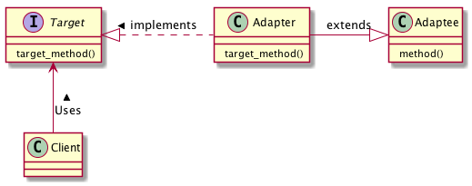
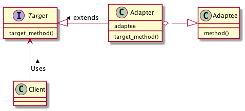

# Adapterパターン
- インタフェースに互換性の無いクラス同士を組み合わせることを目的としたパターン
  - これまで利用していたメソッドと同じ機能を、よりすぐれた形で提供するメソッドを持つクラスの存在を知ったとする。
  - このすぐれたメソッドは、これまで利用していたメソッドとは異なるインタフェースを持つため、切り替えには多大な変更が必要となる場合がある
  - このとき、この2つのメソッドのインタフェースの違いを吸収してやる Adapter を準備することで、少ない変更で新しいメソッドに切り替えることができる

## 実際に使ってみる
### 題材
- 部下の中にリーダーを用意する
- `enjoy_with_all_person` ができるTomにリーダーを任せたい
- リーダーには `organizeAll` ができる必要がある

```python
class Tom:
    def enjoy_with_all_person(self):
        print("enjoy Everyone!!")


class ChairPerson(metaclass=ABCMeta):

    @abstractmethod
    def organize_all(self):
        pass


class Boss:
    def main(self):
        chair_person = Tom()
        chair_person.organize_all()

```
- この状態だとうまくいかない（Tomには `organizeAll` の能力がない）。Tomに `ChairPerson` インタフェースを実装させる必要がある。
- Adapterパターンには継承パターン、委譲パターンがある。今回は継承パターン。

### 実装１：継承パターン

```python
class NewTom(Tom, ChairPerson):
    def organize_all(self):
        super().enjoy_with_all_person()


# Bossクラスの変更
class Boss:
    def main(self):
        chair_person = NewTom()
        chair_person.organize_all()

```
- これにより、BossがTomに対して「みんなをまとめて」と声をかければ、Tomの `enjoy_with_all_person` の能力を使うことができる。
- `ChairPerson` クラスのようなAdaptorクラス（インタフェース）を用意することで元々もっていたメソッドをそのまま流用することができる。

### 委譲パターン
- Tomにどうしても `ChairPerson` させられない場合。Maryにリーダーを任せて、うまくTomの能力を使わせることを考える。

```python
class Mary(ChairPerson):

    def __init__(self):
        self._tom = Tom()

    def organize_all(self):
        self._tom.enjoy_with_all_person()


# Bossクラスの変更
class Boss:
    def main(self):
        chair_person = Mary()
        chair_person.organize_all()
```

## Adapterパターンのまとめ
- 利用したいインタフェースを強制的に変えたいときに使える
- 利用方法は継承/委譲の２パターン。
- Adapterパターンのクラス図は以下のようになる



