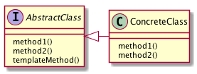

# TemplateMethodパターン
- スーパークラスで処理の枠組みを定め、サブクラスでその具体的内容を実装する

## 実際に使ってみる
### 題材
- ざっくりした業務マニュアルを作成する

```python
# -*- coding:utf-8 -*-
from abc import ABCMeta, abstractmethod


class Manual(metaclass=ABCMeta):
    @abstractmethod
    def check_mail(self):
        pass

    @abstractmethod
    def edit_list(self):
        pass

    @abstractmethod
    def send_mail(self):
        pass


class JohnManual(Manual):
    def check_mail(self):
        print("mailアプリでメール確認")

    def edit_list(self):
        print("VBAを使ってリスト修正")

    def send_mail(self):
        print("VBAからそのままメール送信")

```

- テンプレートとなる `Manual` クラスを作成
- Johnはそれを継承した `JohnManual` を作成
- テンプレートの流れに沿って独自のやり方を実現

## TemplateMethodパターンのまとめ

