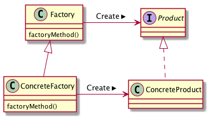

# FactoryMethodパターン
- オブジェクトの生成方法に一工夫加えることで、より柔軟にオブジェクトを生成することを目的とするもの
- インスタンスの生成をサブクラスに行わせることで、より柔軟に生成するインスタンスを選択することが可能となる
- 通常、以下のようにインスタンスを生成する
```python
chair_person = Mary()
```
- FactoryMethodパターンではオブジェクトの生成を担うメソッド(factory method)を通して間接的にオブジェクトを生成する
```python
class Factory(metaclass=ABCMeta):

    @abstractmethod
    def _create_product(self, owner):
        pass

    def create(self, owner):
        self.__p = self._create_product(owner)
```


## 実際に使ってみる
### 題材
- メモをとるという業務を定義
- メモを取る先の材料（紙、電子ペーパー）は個人の自由
- Johnは電子ペーパーにメモを取りたい

```python
# -*- coding:utf-8 -*-
from abc import ABCMeta, abstractmethod


class Editable:
    pass


class Paper(Editable):
    pass


class Manual(metaclass=ABCMeta):

    @abstractmethod
    def edit(self, material: Editable):
        pass

    @abstractmethod
    def create_material(self):
        return Paper()

    @abstractmethod
    def take_memo(self):
        material = self.create_material()
        self.edit(material)


class ElectronicPaper(Editable):
    pass


class JohnManual(Manual):
    def edit(self, material):
        print("電子ペーパーにメモをとる")

    def create_material(self):
        return ElectronicPaper()

    def take_memo(self):
        material = self.create_material()
        self.edit(material)

```
- インスタンス生成のためのメソッドを用意する。そして、そのインスタンスを生成するためのメソッドを通してインスタンスの生成を行う。
- create_material メソッドをオーバーライドするメソッドを記述し、メモをとる先の材料を自由に選択することができるようになる

## FactoryMethodパターンのまとめ

