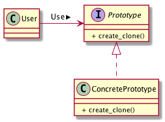

# Prototypeパターン
- あらかじめ用意しておいた「原型」からインスタンスを生成するようにするためのパターン
- 例:
  - 「直線を描く」機能しか持たない図形エディターを考える。
  - この図形エディターで星型を書きたいときには、直線を組み合わせることで、星の形を作成していくことになる。
  - 星型がいくつも欲しいときは、直線を組み合わせて星型を描くという作業を何度も繰り返す必要が出てくる。
  - こんなとき、最初に作成した星型(直線の集まり)を「プロトタイプ」として登録しておき、これをコピーすることで星型が作成できれば、作業が簡略化できる


## 実際に使ってみる
### 題材
- インスタンスの中身ごとコピーしたい

```python
# -*- coding:utf-8 -*-
import copy


def main():
    report1 = Report("title1", "content")
    report2 = copy.deepcopy(report1)

    print("title:", report1.title, report2.title)
    print("content:", report1.content, report2.content)


class Report:
    def __init__(self, title, content):
        self.title = title
        self.content = content


if __name__ == "__main__":
    main()
```

```bash
title: title1 title1
content: content content
```

- pythonの場合、 `copy.deepcopy` を利用することでインスタンスの中身ごとコピーができる
- さらに拡張して、文字列を囲ったりするプログラムを書いてみる

```python
# -*- coding:utf-8 -*-

import copy


class Product(object):
    def use(self, s):
        pass

    def createClone(self):
        pass


class Manager(object):
    __showcase = dict()

    def register(self, name, proto):
        self.__showcase[name] = proto

    def create(self, protoname):
        p = self.__showcase.get(protoname)
        return p.createClone()


class MessageBox(Product):
    def __init__(self, decochar):
        self.decochar = decochar

    def use(self, s):
        length = len(s)
        deco = self.decochar * (length + 4)
        print(deco)
        print(self.decochar, s, self.decochar)
        print(deco)

    def createClone(self):
        p = copy.deepcopy(self)
        return p


class Underline(Product):
    def __init__(self, ulchar):
        self.ulchar = ulchar

    def use(self, s):
        length = len(s)
        print('"%s"' % s)
        print(" %s " % (self.ulchar * length))

    def createClone(self):
        p = copy.deepcopy(self)
        return p


if __name__ == "__main__":
    manager = Manager()
    uline = Underline("~")
    mbox = MessageBox("*")
    sbox = MessageBox("/")
    pbox = MessageBox("+")
    uline2 = Underline("=")
    manager.register("strong message", uline)
    manager.register("star box", mbox)
    manager.register("slash box", sbox)
    manager.register("plus box", pbox)
    manager.register("under line", uline2)

    p1 = manager.create("strong message")
    p1.use("Hello, world.")
    p2 = manager.create("star box")
    p2.use("Hello, world.")
    p3 = manager.create("slash box")
    p3.use("Hello, world.")
    p4 = manager.create("plus box")
    p4.use("Hello, world.")
    p5 = manager.create("under line")
    p5.use("Hello, world.")
```

```bash
"Hello, world."
 ~~~~~~~~~~~~~
*****************
* Hello, world. *
*****************
/////////////////
/ Hello, world. /
/////////////////
+++++++++++++++++
+ Hello, world. +
+++++++++++++++++
"Hello, world."
 =============
```

## Prototypeパターンのまとめ

