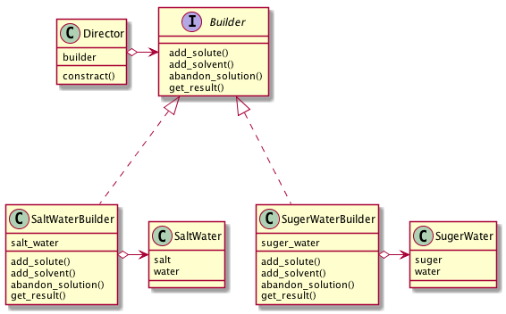
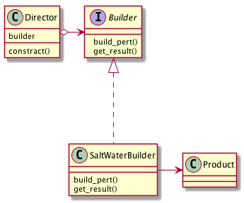

# Builderパターン
- 同じ作成過程で異なる表現形式の結果を得るためのパターン
- 例:
  - 家を建てることを考える
  - 家を建てるには「何を使って（＝材料）」「どう建てるか（＝工程）」が必要
  - 材料には木材、コンクリート、瓦・・・・など色々ある
  - 工程には平屋、２階建て、変わった家・・・・など色々ある
  - これらのパターンを予め用意しておくことで『 "ちょっと変わった平屋を建てる作成過程" で "柱は鉄で壁と屋根はコンクリート" の家を建ててください』という要望に柔軟に応えられる
- Builder パターンとは、このような、「作成過程」を決定する Director と呼ばれるものと「表現形式」を決定する Builder と呼ばれるものを組み合わせることで、オブジェクトの生成をより柔軟にし、そのオブジェクトの「作成過程」をもコントロールすることができるようにするためのパターン


## 実際に使ってみる
### 題材
- 理科の実験で、食塩水と砂糖水を作ることを考える
- 食塩水 をあらわすクラスは以下のソースコードで与えられているものとする(砂糖水をあらわすクラスも同様とする)

```python
# -*- coding:utf-8 -*-


class SaltWater:

    salt = None
    water = None

    @staticmethod
    def salt_water(water, salt):
        SaltWater.salt = salt
        SaltWater.water = water
```

- さまざまな要求が考えられるが、Builderパターンを利用することで、以下のような要求に応えることができるようになる。
  - 同様の作成過程で得られる溶液を何度も利用したい。
  - 同じ方法で砂糖水を作成したい。
- このような要求に応えるため、Builder パターンでは、Director と Builder となるクラスを作成する。
  - Director の役割は「作成過程」を決定することで、Builder の役割は「表現形式」を決定すること。
- サンプルケースでは、Director の役割は、「100g の溶媒に 40g の溶質を溶かし、うち 70g を捨てた後、溶媒を 100g 追加し、最後に溶質を 15g 加える」ということを決定すること。
- また、Builder の役割は、「溶媒に水、溶質に食塩」を使うことを決定すること。

- Builderインタフェースは以下のようになる
```python
from abc import ABCMeta, abstractmethod


class Builder(metaclass=ABCMeta):

    @abstractmethod
    def add_solute(self):
        pass

    @abstractmethod
    def add_solvent(self):
        pass

    @abstractmethod
    def avandon_solution(self):
        pass

    @abstractmethod
    def get_result(self):
        pass
```
- Builder インタフェースでは、溶質を追加するための addSolute メソッド、溶媒を追加するための addSolvent メソッド、溶液を捨てるための abandonSolution メソッド、そして、生成物を得るための、getResult メソッドを定義している。
- Director クラスでは Builder インタフェースを利用して、「作成過程」にのっとって、インスタンスを組み立てていく。

```python
class Director:

    def __init__(self):

        self.builder = Builder()

    def constract(self):
        self.builder.add_solvent(100)
        self.builder.add_solute(40)
        self.builder.abandon_solution(70)
        self.builder.add_solvent(100)
        self.builder.add_solute(15)
```

- Director クラスは、Builder インタフェースを実装するものが与えられるということを知っているだけで、実際には、どの Builder 実装クラスが渡されるのかということを知っている必要がない。これにより、Builder のすげ替えが簡単に行えるようになっている。
- Builder実装クラスである、SaltWaterBuilder クラスは以下のようになる。

```python
class SaltWaterBuilder(Builder):

    def __init__(self):
        self._salt_water = SaltWater(0,0)

    def add_solute(self, salt_amount):
        self._salt_water.salt += salt_amount

    def add_solvent(self, water_amount):
        self._salt_water.water += water_amount

    def abandon_solution(self, salt_water_amount):
        salt_delta = salt_water_amount * (self._salt_water.salt / (self._salt_water.salt + self._salt_water.water))
        water_delta = salt_water_amount * (self._salt_water.water / (self._salt_water.salt + self._salt_water.water))
        self._salt_water.salt -= salt_delta
        self._salt_water.water -= water_delta

    def get_result(self):
        return self._salt_water
```

- このような設計にしておくことで、Director と Builder を自由に組み合わせ、より柔軟にインスタンスを生成することができるようになる。

- 例えば、文書の作成手順を知る Director と、HTML用に出力する HTMLBuilder、プレーンテキストを出力する PlainTextBuilder などを用意しておくことで、同じ文書を要求に合わせて、異なる表現形式で出力することができるようになる。


## Builderパターンのまとめ

