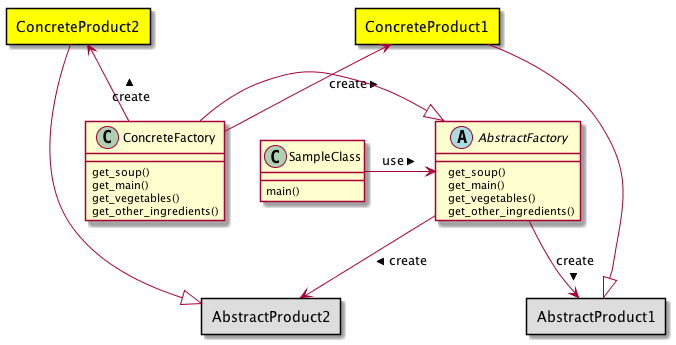

# AbstractFactoryパターン
- インスタンスの生成を専門に行うクラスを用意することで、整合性を必要とされる一連のオブジェクト群を間違いなく生成するためのパターン
- 例
  - 「車」を作成するプログラムを考える
  - 「車」オブジェクトである変数 car にタイヤとハンドルを追加してみる
  ```python
  car.add_tire(CarTire());
  car.add_handle(CarHandle());
  ```
  - プログラマのミスで異なるタイヤ（自転車のタイヤ）を渡してしまうこともあるかもしれない
  ```python
  car.add_tire(BicycleTire());
  car.add_handle(CarHandle());
  ```
  - 利用すべきではないオブジェクトを利用してしまうことはあり得る
  - このようなとき、車を作成するために必要な一連のオブジェクトを作成することを一手に引き受ける工場クラスを用意し、タイヤやハンドルといったオブジェクトを生成するときは、この工場クラスを利用してオブジェクトの生成を行うようにすることで、先ほどのような間違いが起こることを回避することができる
  - この工場クラスを変更することで、利用する一連のオブジェクトをごっそり変更することもできるようになる。

## 実際に使ってみる
### 題材
- 「鍋」を作ることを考える
- 構成要素
  - スープ
  - メインの具(たんぱく質)
  - 野菜
  - その他の具
- 鍋物をあらわす HotPot クラスは以下のように定義されているものとする

```python
# -*- coding:utf-8 -*-


class HotPot:
    pot = None
    soup = None
    protein = None
    vegetables = []
    other_ingredients = []

    @staticmethod
    def hot_pot(pot):
        HotPot.pot = pot

    @staticmethod
    def add_soup(soup):
        HotPot.soup = soup

    @staticmethod
    def add_main(protein):
        HotPot.protein = protein

    @staticmethod
    def add_vegitables(vegitables):
        HotPot.vegetables = vegitables

    @staticmethod
    def add_other_ingredients(other_ingredients):
        HotPot.other_ingredients = other_ingredients

```

- 鍋を作る工程を抽象化した Factory クラスを用意する

```python
class Factory(metaclass=ABCMeta):

    @abstractmethod
    def get_soup(self):
        pass

    @abstractmethod
    def get_main(self):
        pass

    @abstractmethod
    def get_vegetables(self):
        pass

    @abstractmethod
    def get_other_ingredients(self):
        pass

```

- これを継承したMizutaki（水炊き）Factoryクラスを用意し、これをもとに水炊きをつくる。

```python
class MizutakiFactory(Factory):

    def get_soup(self):
        return "torigara"

    def get_main(self):
        return "chicken"

    def get_vegetables(self):
        return ["hakusai", "ninjin", "negi"]

    def get_other_ingredients(self):
        return ["tofu"]


class Sample:

    @staticmethod
    def main():
        hp = HotPot()
        mf = MizutakiFactory()

        hp.add_soup(mf.get_main())
        hp.add_main(mf.get_main())
        hp.add_vegitables(mf.get_vegetables())
        hp.add_other_ingredients(mf.get_other_ingredients())

```

- 引数に与えられた文字列によって、実際に利用する Factory クラスを選択して生成する

```python
class Sample:


    @staticmethod
    def create_factory(s):
        if s == "キムチ鍋":
            return KimuchiFactory()

        elif s == "すき焼き":
            return SukiyakiFactory()

        else:
            return MizutakiFactory()

    @staticmethod
    def main(arg):
        hp = HotPot()
        fc = create_factory(arg)

        hp.add_soup(fc.get_main())
        hp.add_main(fc.get_main())
        hp.add_vegitables(fc.get_vegetables())
        hp.add_other_ingredients(fc.get_other_ingredients())
```

- main メソッドの中では、Factory メソッドの実際の型を知ることなく処理が進んでいる。すなわち、抽象的な Factory クラスを利用して処理を進めていっている。
- 「利用するオブジェクト群をごそっと入れ替える」という要求に応えることができる


## Builderパターンのまとめ

